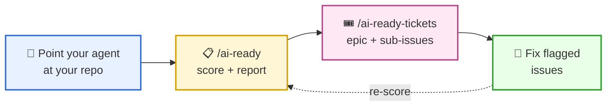

# AI Ready?

> Make any repository legible and productive for AI coding agents.

`ai-ready` is a rubric and two skills built around it: one grades your
repo, the other turns the gaps into GitHub issues. If an agent can't
build your project, write your tests, or open a PR without
hand-holding, this tells you why — and what to do next.

---

## The loop



Run the skills from any compatible agent (Claude Code, Codex,
OpenCode, Pi).

### 1. Score

```text
/ai-ready .
```

Returns a 0–100 score, per-category breakdown, strengths, weaknesses,
and a top-3 improvements list.

### 2. File the follow-ups

```text
/ai-ready-tickets
```

[ai-ready-tickets](skills/ai-ready-tickets/SKILL.md) parses the report
and files one tracking epic plus one GitHub issue per follow-up.
Re-runs are idempotent.

### 3. Fix, then re-score

Work the tickets, re-run `/ai-ready`, watch the number move. The
rubric is the goal; the ticket list is the path.

---

## For developers

The rubric grades repos; developers still have to work with agents
well. A three-step track:

1. **Read** [docs/AI_DEVELOPER_ONBOARDING.md](docs/AI_DEVELOPER_ONBOARDING.md)
   — the checklist of habits that separate "I tried an agent once"
   from "agents ship most of my code."
2. **Self-assess** with [docs/QUIZ.md](docs/QUIZ.md) — 30 questions;
   anything you can't answer points to a section of the onboarding
   doc.
3. **Drill** with [docs/EXERCISES.md](docs/EXERCISES.md) — nine
   hands-on exercises, easiest first. Start with Exercise 1 (automate
   a daily task) and Exercise 3 (hand a PR review cycle to the agent);
   both pay off immediately.

---

## What's in here

For humans:

| Path | Purpose |
| ---- | ------- |
| [docs/SPECIFICATION.md](docs/SPECIFICATION.md) | Purpose, scope, architecture diagram. |
| [skills/ai-ready/SKILL.md](skills/ai-ready/SKILL.md) | The 9-category scoring rubric. |
| [skills/ai-ready-tickets/SKILL.md](skills/ai-ready-tickets/SKILL.md) | Report → GitHub issues. |
| [docs/AI_DEVELOPER_ONBOARDING.md](docs/AI_DEVELOPER_ONBOARDING.md) | How developers should use agents. |
| [docs/EXERCISES.md](docs/EXERCISES.md) | Nine hands-on drills. |
| [docs/QUIZ.md](docs/QUIZ.md) | 30-question self-check. |
| [docs/adr/](docs/adr/) | Architecture Decision Records. |

For agents: [AGENTS.md](AGENTS.md) (and its `CLAUDE.md` alias) is the
machine-readable entry point. Humans don't need to read it.

## The rubric at a glance

| # | Category | Why it matters |
| - | -------- | -------------- |
| 1 | Project context | Agents can't work without an AGENTS.md-style map. |
| 2 | Spec & architecture | Progressive disclosure beats hunting through code. |
| 3 | AI tool config | Skills, hooks, MCP — the agent's standard library. |
| 4 | DevOps integration | Can the agent actually open a PR? |
| 5 | Dev environment | Reproducibility prevents "works on my box" |
| 6 | Type safety | Static checks catch what tests don't. |
| 7 | Test infra | Agents need fast, reliable signal. |
| 8 | Modularity | Small files load into context. |
| 9 | Documentation | Non-obvious logic needs a written trail. |

Each category scores 0–3. Total is `round(sum / 27 × 100)`.

## Contributing

PRs welcome. Start with [CONTRIBUTING.md](CONTRIBUTING.md).

## License

TBD.
