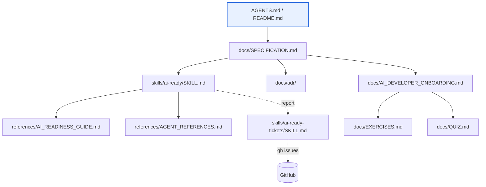

# Specification

## Purpose

`ai-ready` is a reference project for making repositories legible and
productive for AI coding agents. It exists to:

1. Define what "AI-ready" means, concretely, through a scored rubric.
2. Provide a reusable skill that grades any repository against that rubric.
3. Serve as its own worked example — the repo itself should pass the rubric.

## Audience

- **Developers** adopting AI agents in their projects, who need a
  checklist and rationale for why each signal matters.
- **AI coding agents** (Claude, Codex, and peers) working inside this
  repo or running the skill elsewhere.

## Scope

In scope:

- The scoring rubric and its rationale.
- Reference material: ecosystem-specific filenames, developer
  onboarding guidance, exercises, and a quiz.
- The skill definition that runs the assessment.

Out of scope:

- Language- or framework-specific templates.
- Executable application code. The repo contains prose, skill
  definitions, and the minimum configuration required for lint,
  link-check, and CI — no runtime or application code.

## Structure

```text
ai-ready/
├── AGENTS.md                         # Agent entry-point (symlink → README.md).
├── README.md                         # Human-facing one-liner + agent entry.
├── CHANGELOG.md                      # Conventional-commit derived history.
├── CONTRIBUTING.md                   # How to contribute (humans and agents).
├── justfile                          # Task runner: check, lint, links, fmt.
├── .editorconfig                     # Cross-editor defaults.
├── .markdownlint.yaml                # Markdown lint rules.
├── .pre-commit-config.yaml           # Optional local hooks for repo checks.
├── .prettierrc                       # Markdown formatting rules.
├── .aiexclude                        # Generic AI ignore.
├── .claudeignore                     # Claude-specific AI ignore.
├── .github/
│   ├── CODEOWNERS
│   ├── PULL_REQUEST_TEMPLATE.md
│   ├── ISSUE_TEMPLATE/
│   └── workflows/check.yml           # Lint, link-check, anchor consistency.
├── docs/
│   ├── SPECIFICATION.md              # This file.
│   ├── LOCAL_TOOLING.md              # Toolchain bootstrap and verification.
│   ├── AI_DEVELOPER_ONBOARDING.md    # How developers should use agents.
│   ├── EXERCISES.md                  # Hands-on practice.
│   ├── QUIZ.md                       # Self-check questions.
│   └── adr/                          # Architecture Decision Records.
└── skills/
    ├── ai-ready/
    │   ├── SKILL.md                  # The scoring skill (rubric + output format).
    │   └── references/
    │       ├── AI_READINESS_GUIDE.md    # Rationale for each rubric item.
    │       └── AGENT_REFERENCES.md      # Filenames/configs per ecosystem.
    └── ai-ready-tickets/
        └── SKILL.md                  # Turns a readiness report into GitHub issues.
```

### How the pieces relate

- [AGENTS.md](../AGENTS.md) is the front door for agents and points here.
- [SKILL.md](../skills/ai-ready/SKILL.md) is the executable rubric; each of
  its 9 categories and ~30 signals link to a matching anchor in
  [AI_READINESS_GUIDE.md](../skills/ai-ready/references/AI_READINESS_GUIDE.md).
- The guide links out to [AGENT_REFERENCES.md](../skills/ai-ready/references/AGENT_REFERENCES.md)
  for concrete filenames rather than inlining them.
- [AI_DEVELOPER_ONBOARDING.md](AI_DEVELOPER_ONBOARDING.md) covers the
  human side: how developers should adopt and use agents.
  [LOCAL_TOOLING.md](LOCAL_TOOLING.md) is the concrete setup path for
  the repo's required local CLI tools.
  [EXERCISES.md](EXERCISES.md) and [QUIZ.md](QUIZ.md) are its companions.

This layering is the progressive-disclosure pattern the rubric itself
recommends (signal 2.2): short entry points, deep references.

### Diagram



- Solid arrows: direct links from one document to another.
- Dashed arrows: data flow between skills at runtime.

## Design decisions

Each bullet below is backed by an ADR under [adr/](adr/).

- **Equal category weighting** ([ADR-0002](adr/0002-equal-category-weighting.md)).
  Every category counts for 3 points out of 27. The skill's prose
  flags categories with outsized real-world impact (project context,
  dev environment, tests) when recommending improvements.
- **Verify by doing** ([ADR-0003](adr/0003-verify-by-doing.md)).
  The skill runs commands rather than inspecting file presence alone.
  A `justfile` that fails is worse than no `justfile`.
- **Split skill pipeline** ([ADR-0004](adr/0004-split-skill-pipeline.md)).
  `ai-ready` is read-only; `ai-ready-tickets` opens issues from its
  report. The report format is the contract between them.
- **Prose plus minimal config** ([ADR-0001](adr/0001-markdown-plus-minimal-config.md)).
  The repo is markdown content and the thinnest possible configuration
  for lint, link-check, and CI — no application code. This keeps it
  reproducible and agent-legible while still letting the repo pass its
  own rubric (task runner, lint, CI).
- **One skill, many references.** `SKILL.md` stays short; anything that
  would bloat it lives under `references/`.
- **Dogfood the rubric.** Decisions are recorded as ADRs under
  [adr/](adr/), cross-linked from this spec, as signal 2.5 requires.

## Extending this project

- **Adding a rubric item**: add it to [SKILL.md](../skills/ai-ready/SKILL.md),
  add a matching anchor section to
  [AI_READINESS_GUIDE.md](../skills/ai-ready/references/AI_READINESS_GUIDE.md),
  and — if it references concrete filenames — extend
  [AGENT_REFERENCES.md](../skills/ai-ready/references/AGENT_REFERENCES.md).
- **Adding a skill**: create `skills/<name>/SKILL.md` with frontmatter
  (`name`, `description`, `user-invocable`, `allowed-tools`) and link it
  from [AGENTS.md](../AGENTS.md) if agents should discover it.
- **Adding diagrams**: place them under `docs/` and link from here.
  Mermaid blocks are preferred over binary images.
- **Adding an ADR**: copy the next numbered template under [adr/](adr/),
  record context, options, and outcome, and link it from here under
  "Design decisions" if it affects repo-wide choices.
